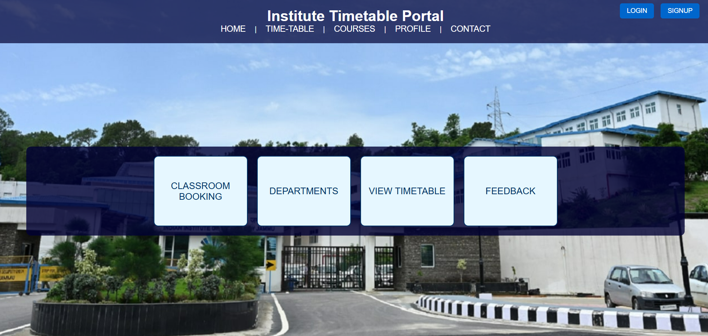

# Time Table Management System (TTMS)

The **Time Table Management System (TTMS)** is a robust and flexible platform designed to streamline course scheduling, classroom allocation, and student enrollment for educational institutions. It provides features to efficiently manage timetables and resolve conflicts, ensuring smooth academic operations.

## Features

1. **Conflict Detection and Resolution**
   - Automatically detects and resolves scheduling conflicts for instructors, classrooms, and students.

2. **Flexibility and Updates**
   - Supports real-time updates to reflect changes in schedules, classrooms, or courses.

3. **Search and Filter**
   - Enables users to search and filter schedules by course, instructor, classroom, or time slots.

4. **Timetable Generation**
   - Automatically generates optimal timetables based on course and instructor availability.

5. **Course Scheduling**
   - Assigns specific time slots, classrooms, and instructors to courses efficiently.

6. **Student Enrollment**
   - Tracks enrolled courses for students each semester.

7. **Classroom Management**
   - Manages classroom bookings to prevent double booking and ensures proper allocation.

## Transaction Management

Transaction management is used to ensure data consistency and integrity while booking a slot for a course and a classroom. The system updates three tables: `Classroom Booking`, `Scheduled Slots`, and `Time Table`. Either all three tables are updated successfully, or none of them are, to maintain consistency. If any operation fails during the transaction, all changes are rolled back to prevent partial updates.

## Technologies Used

- **Frontend**: HTML, CSS, JavaScript
- **Backend**: Node.js
- **Database**: MySQL

### ER Diagram 

